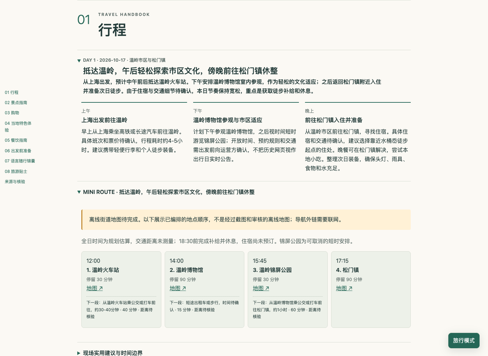

# Travelfolio｜旅页

开源、自托管的旅行规划应用，使用 Vue 3、TypeScript、NestJS 和 PostgreSQL 16。支持用户自带模型 API Key（BYOK），生成旅行方案、管理版本并导出独立 HTML 手册。

应用采用邀请制，面向个人及小范围受邀用户；公开源码不改变应用的注册和权限机制。

## 功能

- 邀请码注册、登录、管理员创建邀请及停用账号
- 每位用户独立保存行程和模型设置，API Key 在服务器端加密存储
- 填写出发地、目的地、日期、人数、全员总预算、偏好和避雷项
- 独立 Worker 生成大纲；用户确认后开展研究并编译八模块旅行手册
- Brave Search 检索、受控网页抓取，以及来源、图片、地图和核验状态记录
- 持久检查点、任务取消和显式恢复；可能已计费的调用不会自动重试
- 候选方案经审阅和单独采用后成为当前版本；支持历史、回滚和丢弃候选
- 导出 JSON 或独立 HTML；HTML 可由浏览器打印为 PDF
- 可选合成演示模式，不调用模型或搜索服务

工作流：创建行程 → 生成大纲 → 确认大纲 → 研究与编译 → 审阅候选 → 采用。

## 出品效果

下面是项目实际生成的「温岭水桶岙周末徒步」手册，展示八章目录、每日行程与手机旅行模式。

**桌面封面与目录**


**每日行程**



**手机旅行模式**


[下载完整 HTML 示例](docs/examples/shuitongao.html)（打开文件页面后选择 Raw / Download raw file，保存后用浏览器打开）。截图用于展示实际生成效果；示例保留了原有的来源与待核验标记。

## 快速启动

需要 Docker Engine / Docker Desktop，以及支持 `docker compose` 的 Compose。以下命令适用于 macOS/Linux；Windows 可使用 WSL。

```sh
git clone https://github.com/yzy9527/travelfolio-mvp.git
cd travelfolio-mvp
cp .env.example .env
chmod 600 .env
openssl rand -hex 32
openssl rand -hex 32
openssl rand -base64 32
```

将三次随机输出依次填入 `.env` 的 `POSTGRES_PASSWORD`、`APP_DB_PASSWORD` 和 `KEY_ENCRYPTION_SECRET`，三者独立生成。示例没有默认密码或管理员。

本机配置：

```dotenv
APP_ORIGIN=http://localhost:7875
SESSION_COOKIE_SECURE=false
DEMO_ENABLED=false
```

`APP_ORIGIN` 必须与浏览器访问地址的协议、主机和端口完全一致。HTTP 和非 Secure Cookie 仅用于本机调试；公网部署使用 HTTPS，并设置 `SESSION_COOKIE_SECURE=true`。

```sh
docker compose config --quiet
docker compose up -d --build
docker compose ps
curl --fail http://localhost:7875/api/health
docker compose exec api node api/dist/admin-cli.js
```

按提示创建首位管理员，再打开 [本机应用](http://localhost:7875) 登录并创建邀请码。首次构建需要联网；启动时自动迁移数据库。数据库使用持久卷，Web 默认只绑定 `127.0.0.1:7875`。

完整的 `docker compose config` 输出包含环境变量中的秘密，校验配置时使用 `--quiet`。

### 配置模型与检索

在“模型设置”中选择 OpenAI、DeepSeek 或自定义兼容服务，填写模型名和自己的 API Key。实时完整研究需要配置 Worker 的 `BRAVE_SEARCH_API_KEY`，并将 API 的 `BRAVE_SEARCH_CONFIGURED=true`。自定义服务需支持非流式 Chat Completions 和 JSON object 响应格式。

如需体验演示，将 `DEMO_ENABLED=true` 后重建 API 和 Worker 容器并选择“演示”。演示仅生成合成示例。

保存前核对服务地址；行程约束和修改要求会发送给选定供应商。模型与搜索可能产生费用，应用不提供费用封顶或账单结算。API Key 不会返回前端；更换服务或地址时需重新提供对应 Key。

## 本地开发

需要 Node.js 22+、npm 和可连接的 PostgreSQL。安装依赖并运行检查：

```sh
npm ci
npm run check
```

在启动 API 的终端中导出 `DATABASE_URL`、`KEY_ENCRYPTION_SECRET`、`APP_ORIGIN=http://localhost:5173` 和 `SESSION_COOKIE_SECURE=false`，以及需要的可选配置。直接运行 Node/npm 不会自动加载 Compose 的 `.env`。

```sh
npm run migrate
npm run admin:create
npm run dev:api
# 第二个终端，导出相同配置及检索密钥
npm run dev:worker
# 第三个终端
npm run dev:web
```

Vite 将 `/api` 代理到本机 API。测试与浏览器验证方法见 [前端测试指南](docs/FRONTEND-TESTING.md)。

## 配置

| 变量 | 用途 |
| --- | --- |
| `POSTGRES_PASSWORD` | 数据库引导管理员密码，仅传给 PostgreSQL |
| `APP_DB_PASSWORD` | 独立应用数据库密码，建议使用随机十六进制值 |
| `DATABASE_URL` | 数据库连接串；Compose 自动构造，直接运行时需导出 |
| `KEY_ENCRYPTION_SECRET` | 必填，32 字节随机数据的 Base64，用于加密 BYOK |
| `APP_ORIGIN` | 浏览器访问的精确 Origin，不带路径或结尾斜杠 |
| `SESSION_COOKIE_SECURE` | 公网 HTTPS 环境必须为 `true` |
| `WEB_PORT` | 本机 Web 端口，默认 `7875`；修改后同步更新 Origin |
| `DEMO_ENABLED` | 默认 `false`，启用合成演示 |
| `BRAVE_SEARCH_API_KEY` | Worker 共享检索凭据，实时完整研究必需 |
| `BRAVE_SEARCH_CONFIGURED` | API 能力标识，配置好 Worker 检索后设为 `true` |
| `RESEARCH_OFFICIAL_HOSTS` | 运营者核对的官网域名列表，以逗号分隔 |
| `WORKER_DNS_MODE` | Worker DNS 模式，默认 `cloudflare`，也支持 `google` / `system` |
| `WORK_ROOT` | Worker 私有工作目录，Compose 使用 `/data/jobs` |
| `CHROMIUM_PATH` | 直接运行 Worker 时配置受支持的 Chromium 绝对路径 |

## 使用范围与限制

- 适合可信运营者管理的小规模邀请制应用；没有公开自助注册、订阅收费、邮件找回密码或协作编辑。
- 不提供实时航班酒店库存或自动预订。交通、价格、营业时间、签证和安全信息需在官方渠道再次确认。
- 检索来源和结构化验证不等于事实、图片主体或地图已核实；演示样例不代表真实研究结果。
- API Key 的静态加密不等于行程端到端加密。拥有宿主机、数据库和主密钥权限的人员可能访问数据。
- 界面显示最近 200 份行程、每份最近 200 个版本及当前采用版本，以及最近 50 条任务；尚无完整分页，旧数据保留在数据库。
- 单元测试和 PGlite 集成测试不替代真实 PostgreSQL、Docker、模型服务、浏览器或部署环境的验证。

公网部署步骤、备份和恢复见 [运维手册](docs/OPERATIONS.md)，安全边界见 [安全说明](docs/SECURITY.md)。仓库提供 [Nginx HTTPS 配置示例](deploy/nginx-https.conf.example)。

## 文档与目录

- `api/`：API、数据库迁移和隔离测试，以及独立 Worker 与 Skill 编译器
- `web/`：Vue 前端、静态 Nginx 配置和前端测试
- `deploy/`：数据库初始化及 HTTPS 配置示例
- [API 约定](docs/API-CONTRACT.md)
- [工作流运维](docs/SKILL-OPERATIONS.md)
- [上游功能对应表](docs/SKILL-FEATURE-PARITY.md)

## 源码打包

```sh
node scripts/package-source.mjs /tmp/travelfolio-source.zip
unzip -t /tmp/travelfolio-source.zip
```

打包器排除密钥、运行数据、依赖和构建产物，并在 ZIP 内生成当前文件的 SHA-256 校验清单。

## 许可证

项目使用 [MIT License](LICENSE)。第三方依赖分别适用各自许可证。

TypeScript Skill 工作流改编自 MIT 授权的 [personalized-travel-guide-skill](https://github.com/TokenHungryMash/personalized-travel-guide-skill)。固定来源和上游许可见 [来源说明](docs/SOURCES-AND-LICENSES.md) 与 [上游许可证](docs/upstream-skill/LICENSE)。
